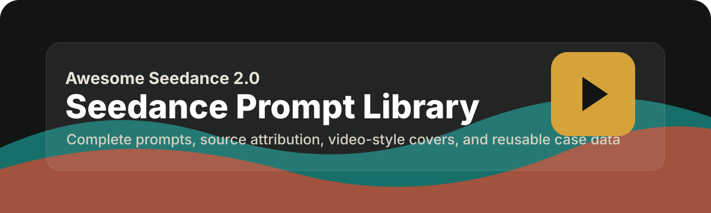

<p align="center"></p>

<h3 align="center">An open Seedance 2.0 prompt case library with source attribution and video-style cover cards</h3>

<p align="center">
  <a href="https://github.com/freestylefly/awesome-seedance2.0"></a>
  <a href="https://github.com/freestylefly/awesome-seedance2.0"></a>
  <a href="https://github.com/freestylefly/awesome-seedance2.0"></a>
  <a href="https://github.com/freestylefly/awesome-seedance2.0"></a>
  <a href="https://awesome-seedance2-0.vercel.app"></a>
</p>

> Seedance 2.0 prompt collection for studying reusable video-generation instructions, camera language, multimodal references, audio cues, and short-form storytelling patterns.

## Project Vision

This repository collects Seedance 2.0 prompts with clear source attribution. The goal is to make useful cases easy to search, copy, compare, and adapt.

The current release includes:

- 71 structured prompt cases
- 42 extracted cases from the Seedance 2.0 Lark document
- 29 external prompt cases collected from a MIT-licensed GitHub repository
- AI-generated video-style PNG covers with SVG fallback
- Pure Prompt first sorting for cases that can generate video without image or video references
- Dark blue, technology-inspired website cards and detail viewer
- A static website that runs without a framework or build step

## Quick Links

- [Live website](https://awesome-seedance2-0.vercel.app)
- [Structured case data](./data/cases.json)
- [Collection status](./docs/collection-status.md)
- [Generated covers](./media/covers/)
- [AI cover assets](./media/covers/ai/)
- [Seedance Lark document](https://bytedance.larkoffice.com/wiki/A5RHwWhoBiOnjukIIw6cu5ybnXQ)
- [External GitHub source](https://github.com/makesupday/Awesome-Seedance-2.0-Prompt-and-Examples)

## Collection Rules

- A formal case must include a complete prompt and a source URL.
- Each case records `sourcePlatform`, `sourceUrl`, `author`, `coverImage`, `coverStatus`, `tags`, and `promptLanguage`.
- Original videos are optional. They are added only when the source permits download or redistribution.
- Cover images are marked separately from original video assets. AI covers use `coverStatus: ai-generated` or `coverStatus: ai-category`; extracted video frames use `coverStatus: video-frame`; SVG fallback covers use `coverStatus: generated`.
- The website sorts Pure Prompt cases first, then image-reference cases, video-reference cases, and mixed-reference cases.
- Cases with sensitive, restricted, or uncertain rights are either skipped or marked with `caution`.

## Category Overview

| Category | Focus |
|---|---|
| 动作复刻 | Action, fighting, body motion, sports movement |
| 商业创意 | Product ads, UGC ads, brand mascot scenes |
| 多镜头叙事 | Shot lists, story arcs, short drama structure |
| 情绪与声音 | Acting, dialogue, emotion, voice direction |
| 声音与口型 | Lip-sync, sound effects, voice-over, multilingual dialogue |
| 视频编辑 | Replacement, rewrite, object or plot edits |
| 视频延长 | Continuation prompts and follow-up scenes |
| 运镜复刻 / 运镜技巧 | Camera motion, tracking, dolly, crane, handheld shots |
| 风格与特效 | Style transfer, VFX, color grading |
| 社媒短片 | Meme, montage, transformation, short-form pacing |

## Featured Cases

| Case | Category | Source | Prompt direction |
|---|---|---|---|
| `case-001` | 动作复刻 | Lark Document | Two female generals fight with image-defined characters, weapons, and video-referenced action rhythm. |
| `case-003` | 商业创意 | Lark Document | Korean ad script for magnetic bow accessories across outfit, hair, and bag scenes. |
| `case-043` | 人物与写实 | GitHub | Professional portrait with medium close-up framing and slow dolly-in camera language. |
| `case-049` | 商业创意 | GitHub | Lifestyle product ad across morning, work, and evening scenes. |
| `case-055` | 多镜头叙事 | GitHub | Corporate revenge short drama with three beats, dialogue, and reaction close-ups. |
| `case-071` | 镜头连贯 | GitHub | First-frame to last-frame transition prompt with identity-preserving motion. |

## Repository Layout

```text
.
├── app.js
├── data/
│   ├── cases.json
│   ├── cases.js
│   └── images/banner.svg
├── docs/
│   └── collection-status.md
├── index.html
├── media/
│   ├── covers/
│   ├── inputs/
│   └── outputs/
├── scripts/
│   ├── build-prompt-library.mjs
│   └── normalize-seedance-rows.mjs
├── styles.css
└── vercel.json
```

## Local Preview

Open `index.html` directly, or run a small static server:

```bash
python3 -m http.server 4173 --bind 127.0.0.1
```

Then visit:

```text
http://127.0.0.1:4173/
```

## Data Model

Each case in `data/cases.json` includes:

- `id`: stable case id, such as `case-043`
- `title`: case title
- `category`: normalized browsing category
- `duration`: suggested or observed duration
- `prompt`: complete prompt text
- `sourcePlatform`: source type, such as `Lark Document` or `GitHub`
- `sourceUrl`: original source URL
- `author`: source author or contributor group
- `coverImage`: local cover image path
- `coverStatus`: `source`, `ai-generated`, `ai-category`, `video-frame`, or `generated`
- `tags`: searchable prompt tags
- `promptLanguage`: `zh`, `en`, or `mixed`
- `caution`: rights or safety note when needed

## Regenerate Data

To rebuild the prompt library and refresh cover references:

```bash
node scripts/build-prompt-library.mjs
```

If you re-import rows from the Lark document first, run:

```bash
node scripts/normalize-seedance-rows.mjs /private/tmp/seedance_rows.json data/cases.json
node scripts/build-prompt-library.mjs
```

Both scripts write:

- `data/cases.json`
- `data/cases.js`
- `media/covers/*.svg` for any case without an AI PNG cover

## Source Attribution

The external prompt set is collected from:

https://github.com/makesupday/Awesome-Seedance-2.0-Prompt-and-Examples

That repository advertises MIT License in its README. Source links are preserved on every external case.

## License

MIT
